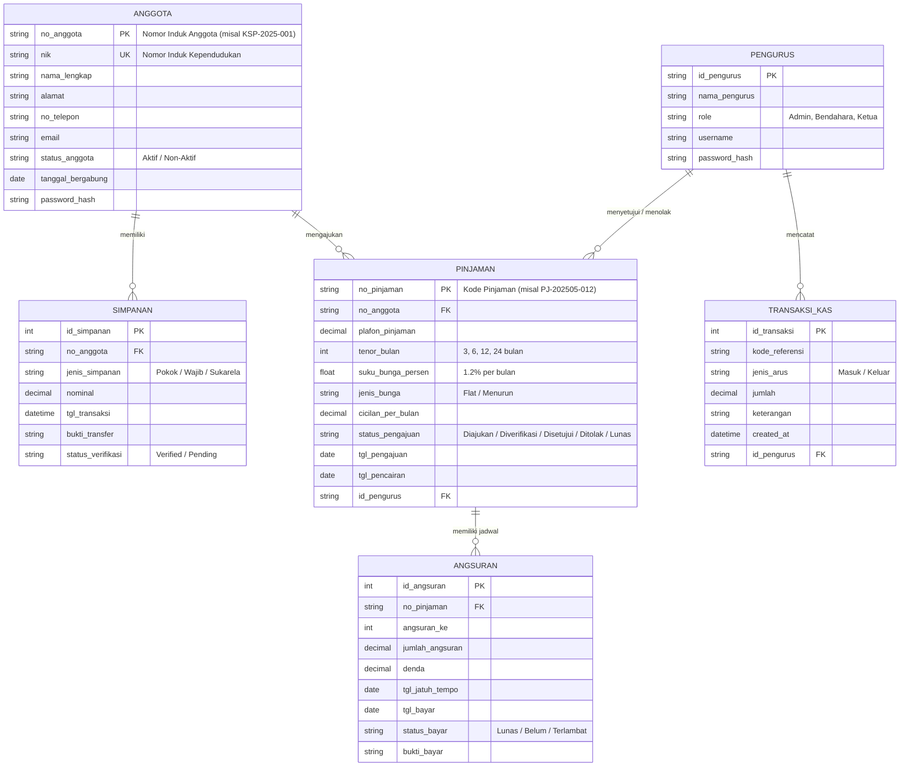
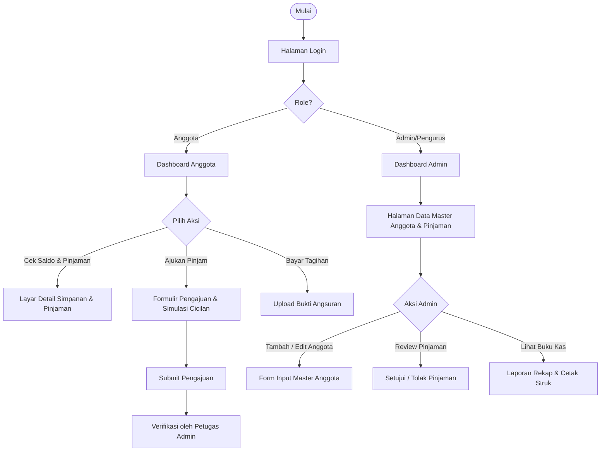

# PERANCANGAN.MD - MILESTONE 1
## Sistem Informasi Koperasi Simpan Pinjam (KSP "Maju Makmur")

---

### 1. Informasi Proyek
- **Topik Proyek**: Sistem Informasi Koperasi Simpan Pinjam
- **Target Platform**: Responsive Web / Mobile-First Application
- **Role Pengguna**: 
  1. **Pengurus / Petugas Admin**: Mengelola data anggota, persetujuan pinjaman, pencatatan simpanan, dan laporan keuangan.
  2. **Anggota Koperasi**: Melihat saldo simpanan (Pokok, Wajib, Sukarela), simulasi & pengajuan pinjaman, riwayat angsuran, serta estimasi SHU.

---

### 2. Hirarki Menu & Arsitektur Informasi (Sitemap)

```
Sistem Informasi Koperasi Simpan Pinjam
├── 0. Autentikasi & Akun
│   ├── Login (Nomor Anggota / NIK & Password)
│   ├── Registrasi Anggota Baru
│   └── Profil Anggota & Pengaturan
│
├── 1. Dashboard Utama
│   ├── Ringkasan Saldo (Simpanan Wajib, Pokok, Sukarela)
│   ├── Kartu Status Pinjaman Berjalan & Jatuh Tempo
│   ├── Quick Action: Setor Simpanan, Ajukan Pinjaman, Bayar Cicilan
│   └── Grafik Arus Kas & Statistik Koperasi
│
├── 2. Data Master (Tabel & Manajemen Data)
│   ├── Master Anggota (Daftar, Status Keaktifan, Filter, CRUD)
│   ├── Master Jenis Simpanan & Produk Pinjaman (Bunga, Tenor)
│   └── Master Petugas / Administrator
│
├── 3. Transaksi Simpan Pinjam (Form Interaktif)
│   ├── Form Pengajuan Pinjaman (Simulasi Angsuran, Plafon, Tenor, Validasi)
│   ├── Form Setor / Tarik Simpanan
│   └── Form Konfirmasi Pembayaran Angsuran
│
└── 4. Laporan & Detail Transaksi
    ├── Rincian Pinjaman & Kartu Angsuran (Jadwal Pembayaran & Status Pelunasan)
    ├── Laporan Buku Tabungan Simpanan
    ├── Laporan Laba Rugi / Alokasi SHU
    └── Cetak Bukti Transaksi Digital (PDF / Print Struk)
```

---

### 3. Konsep ER-D (Entity Relationship Diagram) - Mermaid.js



---

### 4. User Flow Antarmuka (Flowchart Mermaid.js)



---

### 5. Rencana Desain UI & Wireframing (Milestone 1)
1. **Design Tokens & Palette**:
   - **Primary**: Deep Forest Green (`#14532D` / `#16A34A`) mencerminkan stabilitas koperasi & finansial terpercaya.
   - **Secondary / Accent**: Warm Amber / Gold (`#F59E0B`) melambangkan kesejahteraan anggota.
   - **Neutral**: Slate Gray (`#0F172A`, `#334155`, `#F8FAFC`) untuk tipografi jelas & kontras tinggi.
2. **Komponen Reusable**:
   - Status Badges: `Disetujui` (Hijau), `Pending` (Kuning), `Jatuh Tempo` (Merah).
   - Metric Summary Cards (Saldo Pokok, Wajib, Sukarela, dan Sisa Plafon).
   - Form Slider Tenor & Real-time Loan Calculator Preview.
   - Quick Bottom Navigation Bar untuk mobile usability.
